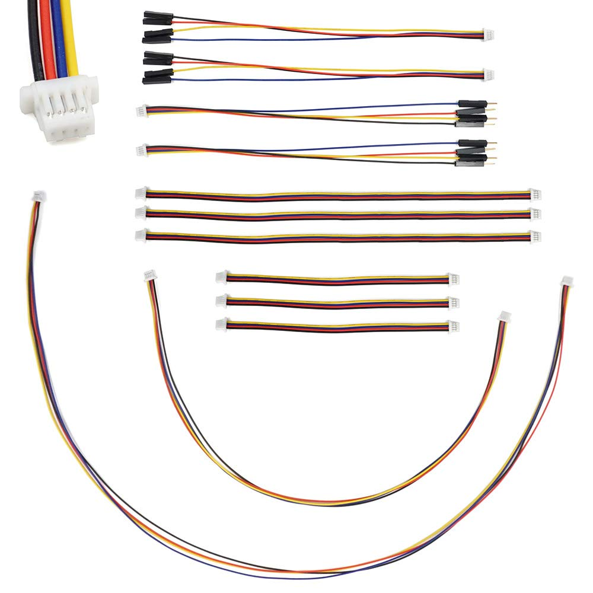

#### ROS2RPI connected to ROSRider with QWIC Cable

The image depicts the physical connection between the ROS2RPi HAT and ROSRider cards using a standard QWIC cable. The ROSRider card's additional QWIC port facilitates cascading configurations, enabling the expansion of the system with multiple ROSRider units or other compatible QWIC devices.

   
   

Qwiic cables are a popular choice for connecting various sensors and actuators to microcontrollers and other devices. They feature a 4-wire JST-SH connector on each end. One unique aspect of Qwiic cables is their asymmetrical orientation. One connector will typically be `top-facing` while the other is `bottom-facing.` This deliberate design choice helps with cable routing and prevents accidental misconnections, making it easier to create clean and organized setups.

#### Controlling ROS2RPI

    

        ⚠️&nbsp;Checkpoint:&nbsp;Prerequisites
    

    

        In order to send I2C commands from your host with Python, you need to install the <code class="language-plaintext highlighter-rouge">python3-smbus2</code> library.
    

    

        For Ubuntu: <code class="language-plaintext highlighter-rouge">sudo apt install python3-smbus2</code>
    

    

        If your Linux distribution does not have the <code class="language-plaintext highlighter-rouge">python3-smbus2</code> package, use pip3 to install package locally:
        <code class="language-plaintext highlighter-rouge">pip3 install smbus2</code>
    

Sending one byte to I2C address `0x20` we can control all the peripherals on the device.

| bit | function     | mask | description                                  |
|-----|--------------|------|----------------------------------------------|
| 0   | PSEL_3V3_A   | 0x01 | Powers on I2C Bus Voltage-Level Translator A |
| 1   | PSEL_3V3_B   | 0x02 | Powers on I2C Bus Voltage-Level Translator B |
| 2   | SERIAL_RX_ON | 0x04 | Connects the RPIs RX to debug port RX        |
| 3   | SERIAL_TX_ON | 0x08 | Connects the RPIs TX to debug port TX        |
| 4   | PSEL_LIDAR   | 0x10 | LIDAR Power ON                               |
| 5   | LIDAR_TX_ON  | 0x20 | Connects the RPIs RX to Lidars TX            |
| 6   | LIDAR_PWM_ON | 0x40 | Connects RPIs GPIO19 to Lidars PWM input     |

    

        ⚠️&nbsp;Checkpoint
    

    

        To ensure you’re in the <code class="language-plaintext highlighter-rouge">i2c</code> group,
        check the <code class="language-plaintext highlighter-rouge">/etc/group</code> file or run the following command:
        <code class="language-plaintext highlighter-rouge">groups</code>
    

    

        If you're not listed, you'll need to add yourself to the group using the following command:
        <code class="language-plaintext highlighter-rouge">sudo usermod -aG i2c $USER</code>
    

    

        Remember to log out and log back in for the group membership change to take effect.
    

#### Understanding Hibernation

The ROSRiders driver leverages the I2C bus to communicate with the ROSRider card.
By powering the I2C port on the ROS2RPi, a wake-up signal is generated, awakening the ROSRider card from a low-power state.
This allows for efficient power management and quick activation when needed.