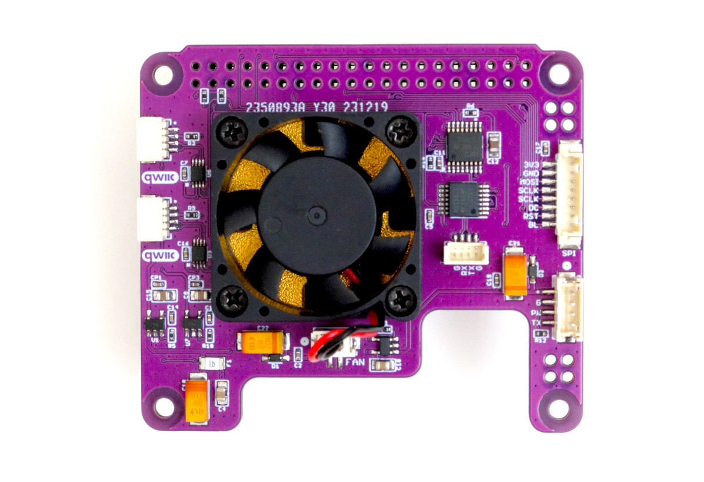
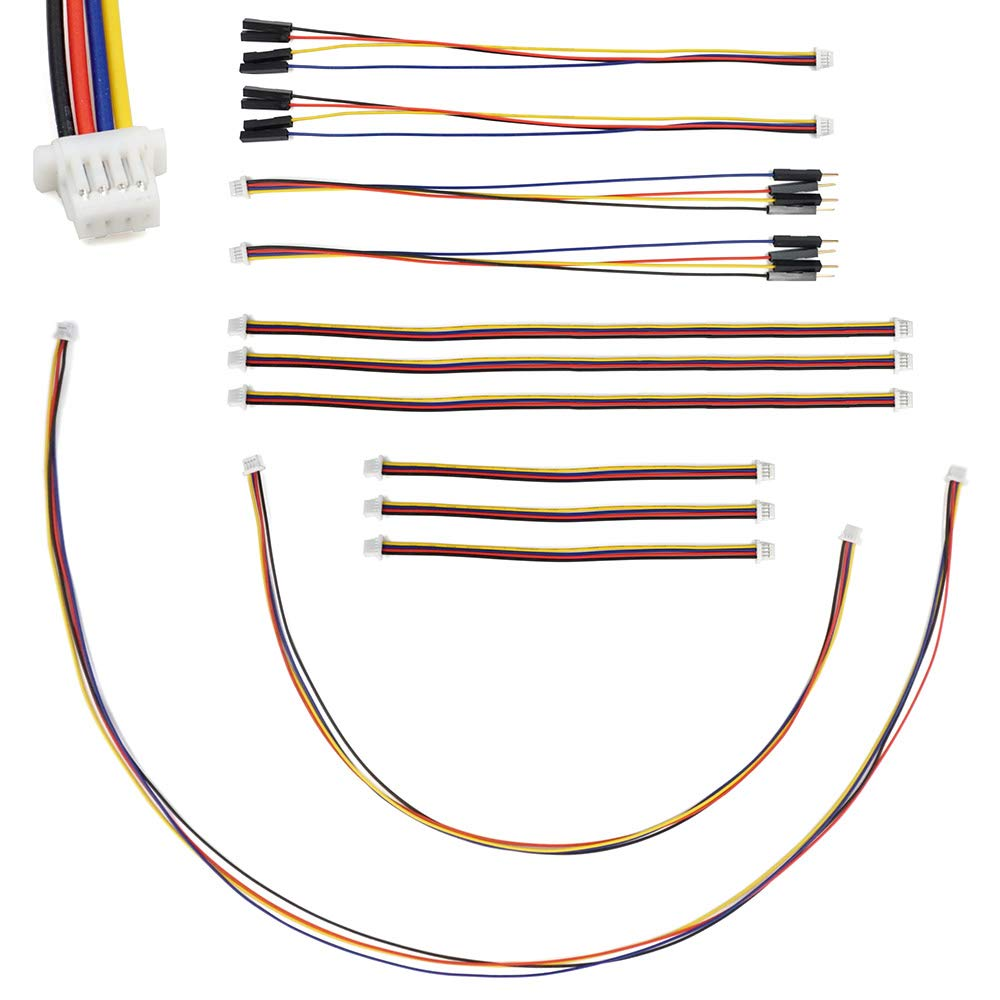

#### Overview

The ***ROS2RPI HAT*** is a powerful add-on board designed specifically for Raspberry Pi 4/5 models. It enhances the capabilities of your Raspberry Pi by providing a range of features, including:

- ***Dual Independent I2C Ports:*** Dual Bidirectional I2C Bus and Voltage-Level Translators, enabling flexible connectivity to a wide range of QWIC sensors.
- ***I2C GPIO Expander:*** The ROS2RPI HAT utilizes an I2C GPIO expander to efficiently manage its functionalities, freeing up valuable Raspberry Pi GPIO pins for other applications.
- ***LIDAR Integration:*** A dedicated port for connecting Lidar sensors, directly interfaced with the Raspberry Pi's hardware serial port.
- ***ROS2RPI HAT*** offers a flexible serial port that can be configured for either LIDAR communication or external debugging. This dual-purpose functionality enables remote debugging and troubleshooting, enhancing the HAT's versatility and ease of use.
- ***Active Cooling:*** A 30mm fan and metal heat sink at the bottom ensures optimal thermal performance, especially during intensive processing or sensor data acquisition.
- ***OLED Display Expansion:*** This port connects RPIs SPI peripheral to a Waveshare 240x280 SPI Display Module. 

<div style="display: flex; justify-content: space-around; margin: 25px 0;">
   
</div>

#### Controlling ROS2RPI

Sending one byte to I2C address `0x20` we can control all the peripherals on the device.

| bit | function | mask | description |
| ----- | ----- | ----- | ----- |
| 0 | PSEL_3V3_A | 0x01 | Powers on I2C Bus Voltage-Level Translator A |
| 1 | PSEL_3V3_B | 0x02 | Powers on I2C Bus Voltage-Level Translator B |
| 2 | SERIAL_RX_ON | 0x04 | Connects the RPIs RX to debug port RX |
| 3 | SERIAL_TX_ON | 0x08 | Connects the RPIs TX to debug port TX |
| 4 | PSEL_LIDAR | 0x10 | LIDAR Power ON |
| 5 | LIDAR_TX_ON | 0x20 | Connects the RPIs RX to Lidars TX |
| 6 | LIDAR_PWM_ON | 0x40 | Connects RPIs GPIO19 to Lidars PWM input |

#### ROS2RPI connected to ROSRider with QWIC Cable

The image depicts the physical connection between the ROS2RPi HAT and ROSRider cards using a standard QWIC cable. The ROSRider card's additional QWIC port facilitates cascading configurations, enabling the expansion of the system with multiple ROSRider units or other compatible QWIC devices.

<div style="display: flex; justify-content: space-around; margin: 25px 0;">
   
   
</div>

Qwiic cables are a popular choice for connecting various sensors and actuators to microcontrollers and other devices. They feature a 4-wire JST-SH connector on each end. One unique aspect of Qwiic cables is their asymmetrical orientation. One connector will typically be `top-facing` while the other is `bottom-facing.` This deliberate design choice helps with cable routing and prevents accidental misconnections, making it easier to create clean and organized setups.

#### Installing Software

<div class="checkpoint">
  <p>⚠️&nbsp;<strong>Prerequisites</strong></p>
  <p>In order to send I2C commands from your host with Python, you need to install the <code class="language-plaintext highlighter-rouge">python3-smbus2</code> library.</p>
  <p>For Ubuntu:</p>
  <div class="highlight notranslate position-relative">
    <div class="highlight">
      <pre id="command-checkpoint-smbus2"><span></span>sudo apt install python3-smbus2</pre>
    </div>
    <clipboard-copy style="position:absolute; right:8px; top:8px;" for="command-checkpoint-smbus2">
      <svg aria-hidden="true" height="16" viewBox="0 0 16 16" version="1.1" width="16" data-view-component="true" class="octicon octicon-copy js-clipboard-copy-icon">
      <path d="M0 6.75C0 5.784.784 5 1.75 5h1.5a.75.75 0 0 1 0 1.5h-1.5a.25.25 0 0 0-.25.25v7.5c0 .138.112.25.25.25h7.5a.25.25 0 0 0 .25-.25v-1.5a.75.75 0 0 1 1.5 0v1.5A1.75 1.75 0 0 1 9.25 16h-7.5A1.75 1.75 0 0 1 0 14.25Z"></path><path d="M5 1.75C5 .784 5.784 0 6.75 0h7.5C15.216 0 16 .784 16 1.75v7.5A1.75 1.75 0 0 1 14.25 11h-7.5A1.75 1.75 0 0 1 5 9.25Zm1.75-.25a.25.25 0 0 0-.25.25v7.5c0 .138.112.25.25.25h7.5a.25.25 0 0 0 .25-.25v-7.5a.25.25 0 0 0-.25-.25Z"></path>
      </svg>
      <svg aria-hidden="true" height="16" viewBox="0 0 16 16" version="1.1" width="16" data-view-component="true" class="octicon octicon-check js-clipboard-check-icon color-fg-success d-none">
      <path d="M13.78 4.22a.75.75 0 0 1 0 1.06l-7.25 7.25a.75.75 0 0 1-1.06 0L2.22 9.28a.751.751 0 0 1 .018-1.042.751.751 0 0 1 1.042-.018L6 10.94l6.72-6.72a.75.75 0 0 1 1.06 0Z"></path>
      </svg>
    </clipboard-copy>
  </div>
  <div class="highlight notranslate position-relative">
    <p>If your Ubuntu version does not have the <code class="language-plaintext highlighter-rouge">python3-smbus2</code> package, use pip3 to install package locally:</p>    
    <div class="highlight">
      <pre id="command-checkpoint-pip-smbus2"><span></span>pip3 install smbus2</pre>
    </div> 
    <clipboard-copy style="position:absolute; right:8px; top:8px;" for="command-checkpoint-pip-smbus2">
      <svg aria-hidden="true" height="16" viewBox="0 0 16 16" version="1.1" width="16" data-view-component="true" class="octicon octicon-copy js-clipboard-copy-icon">
      <path d="M0 6.75C0 5.784.784 5 1.75 5h1.5a.75.75 0 0 1 0 1.5h-1.5a.25.25 0 0 0-.25.25v7.5c0 .138.112.25.25.25h7.5a.25.25 0 0 0 .25-.25v-1.5a.75.75 0 0 1 1.5 0v1.5A1.75 1.75 0 0 1 9.25 16h-7.5A1.75 1.75 0 0 1 0 14.25Z"></path><path d="M5 1.75C5 .784 5.784 0 6.75 0h7.5C15.216 0 16 .784 16 1.75v7.5A1.75 1.75 0 0 1 14.25 11h-7.5A1.75 1.75 0 0 1 5 9.25Zm1.75-.25a.25.25 0 0 0-.25.25v7.5c0 .138.112.25.25.25h7.5a.25.25 0 0 0 .25-.25v-7.5a.25.25 0 0 0-.25-.25Z"></path>
      </svg>
      <svg aria-hidden="true" height="16" viewBox="0 0 16 16" version="1.1" width="16" data-view-component="true" class="octicon octicon-check js-clipboard-check-icon color-fg-success d-none">
      <path d="M13.78 4.22a.75.75 0 0 1 0 1.06l-7.25 7.25a.75.75 0 0 1-1.06 0L2.22 9.28a.751.751 0 0 1 .018-1.042.751.751 0 0 1 1.042-.018L6 10.94l6.72-6.72a.75.75 0 0 1 1.06 0Z"></path>
      </svg>
    </clipboard-copy>
  </div>
</div>

<div class="checkpoint">
    <p>✅&nbsp;<strong>Checkpoint</strong></p>
    <p>
        To ensure you’re in the <code class="language-plaintext highlighter-rouge">i2c</code> group,
        check the <code class="language-plaintext highlighter-rouge">/etc/group</code> file or run the following command:
    </p>
    <div class="highlight notranslate position-relative">
        <div class="highlight">
            <pre id="command-groups"><span></span>groups</pre>
        </div>
        <clipboard-copy style="position:absolute; right:8px; top:8px;" for="command-groups">
            <svg aria-hidden="true" height="16" viewBox="0 0 16 16" version="1.1" width="16" data-view-component="true" class="octicon octicon-copy js-clipboard-copy-icon">
            <path d="M0 6.75C0 5.784.784 5 1.75 5h1.5a.75.75 0 0 1 0 1.5h-1.5a.25.25 0 0 0-.25.25v7.5c0 .138.112.25.25.25h7.5a.25.25 0 0 0 .25-.25v-1.5a.75.75 0 0 1 1.5 0v1.5A1.75 1.75 0 0 1 9.25 16h-7.5A1.75 1.75 0 0 1 0 14.25Z"></path><path d="M5 1.75C5 .784 5.784 0 6.75 0h7.5C15.216 0 16 .784 16 1.75v7.5A1.75 1.75 0 0 1 14.25 11h-7.5A1.75 1.75 0 0 1 5 9.25Zm1.75-.25a.25.25 0 0 0-.25.25v7.5c0 .138.112.25.25.25h7.5a.25.25 0 0 0 .25-.25v-7.5a.25.25 0 0 0-.25-.25Z"></path>
            </svg>
            <svg aria-hidden="true" height="16" viewBox="0 0 16 16" version="1.1" width="16" data-view-component="true" class="octicon octicon-check js-clipboard-check-icon color-fg-success d-none">
            <path d="M13.78 4.22a.75.75 0 0 1 0 1.06l-7.25 7.25a.75.75 0 0 1-1.06 0L2.22 9.28a.751.751 0 0 1 .018-1.042.751.751 0 0 1 1.042-.018L6 10.94l6.72-6.72a.75.75 0 0 1 1.06 0Z"></path>
            </svg>
        </clipboard-copy>
    </div>
    <p>If you're not listed, you'll need to add yourself to the group using the following command:<p>  
</div>

#### Example Python program to turn on both I2C Ports and Lidar

Create a file named `haton.py` under `$HOME\bin` and put the code below inside it

```python
#!/usr/bin/env python
import string
import struct
import sys
import time

from smbus2 import SMBus

with SMBus(1) as bus:

    TCA6408_OUTPUT = 0x01
    TCA6408_CONFIGURATION = 0x03
    TCA6406_ADDRESS = 0x20

    # PSEL_3V3_A	P0	0x01
    # PSEL_3V3_B	P1	0x02
    # SERIAL_RX_ON	P2	0x04
    # SERIAL_TX_ON	P3	0x08
    # PSEL_LIDAR	P4	0x10
    # LIDAR_TX_ON	P5	0x20
    # LIDAR_PWM_ON	P6	0x40

    try:
        bus.write_byte_data(TCA6406_ADDRESS, TCA6408_CONFIGURATION, 0x0)
        bus.write_byte_data(TCA6406_ADDRESS, TCA6408_OUTPUT, 0x73)
    except IOError as e:
        print('IOError: %s' % e)

```

#### Example Python program to turn on both I2C Ports, and switch serial to DEBUG

```python
#!/usr/bin/env python
import string
import struct
import sys
import time

from smbus2 import SMBus

with SMBus(1) as bus:

    TCA6408_OUTPUT = 0x01
    TCA6408_CONFIGURATION = 0x03
    TCA6406_ADDRESS = 0x20

    # PSEL_3V3_A	P0	0x01
    # PSEL_3V3_B	P1	0x02
    # SERIAL_RX_ON	P2	0x04
    # SERIAL_TX_ON	P3	0x08
    # PSEL_LIDAR	P4	0x10
    # LIDAR_TX_ON	P5	0x20
    # LIDAR_PWM_ON	P6	0x40

    try:
        bus.write_byte_data(TCA6406_ADDRESS, TCA6408_CONFIGURATION, 0x0)
        bus.write_byte_data(TCA6406_ADDRESS, TCA6408_OUTPUT, 0x0F)
    except IOError as e:
        print('IOError: %s' % e)
```

#### Example Python program to set ROSRider to hibernate, and turn off all hat functionality

Create a file named `hatoff.py` under `$HOME\bin` and put the code below inside it

```python
#!/usr/bin/env python
import string
import struct
import sys
import time

from smbus2 import SMBus

with SMBus(1) as bus:

   # send hibernate command to ROSRider
   try:
      # 0x04 is sys_ctl address
      bus.write_i2c_block_data(0x3C, 0x04, [0,0,0,0x05])
   except IOError as e:
      print('IOError: %s' % e)

   TCA6408_OUTPUT = 0x01
   TCA6408_CONFIGURATION = 0x03
   TCA6406_ADDRESS = 0x20

   # turn the ROS2RPI board off
   try:
       bus.write_byte_data(TCA6406_ADDRESS, TCA6408_CONFIGURATION, 0x00)
       bus.write_byte_data(TCA6406_ADDRESS, TCA6408_OUTPUT, 0x0)
   except IOError as e:
       print('IOError: %s' % e)
```

#### Example C function send ROS2RPI command

```c
uint8_t send_hat_command(int fd, uint8_t output) {

  int rv_hat = ioctl(fd, I2C_SLAVE, 0x20);
  if(rv_hat<0) { return rv_hat; }

  unsigned char hat_command[1] = {0};
  int rw_hat = I2C_RW_Block(fd, 0x03, I2C_SMBUS_WRITE, 1, hat_command);

  hat_command[0] = output;
  rw_hat = I2C_RW_Block(fd, 0x01, I2C_SMBUS_WRITE, 1, hat_command);

  return rw_hat;
}
```

#### Example C function to send System Control Commands to ROSRider

```c
uint8_t send_sysctl(int fd, uint8_t command) {

  unsigned char sysctl_buffer[5] = {0};
  sysctl_buffer[3] = command;

  uint8_t rw = I2C_RW_Block(fd, 0x04, I2C_SMBUS_WRITE, 5, sysctl_buffer);
  if(rw == 0) { 
  	return 0; 
  } else {
	RCLCPP_INFO(this->get_logger(), "I2C Error: %s", strerror(rw));
	return rw;
  }
}
```

#### Instrumenting Linux to HATON at boot time

Change directory to `/lib/systemd/system` and create `haton.service` file by typing the following commands:

<div class="highlight notranslate position-relative">
<div class="highlight">
  <pre id="command-haton"><span></span>cd /lib/systemd/system  
sudo nano haton.service</pre>
</div>
<clipboard-copy style="position:absolute; right:8px; top:8px;" for="command-haton">
  <svg aria-hidden="true" height="16" viewBox="0 0 16 16" version="1.1" width="16" data-view-component="true" class="octicon octicon-copy js-clipboard-copy-icon">
  <path d="M0 6.75C0 5.784.784 5 1.75 5h1.5a.75.75 0 0 1 0 1.5h-1.5a.25.25 0 0 0-.25.25v7.5c0 .138.112.25.25.25h7.5a.25.25 0 0 0 .25-.25v-1.5a.75.75 0 0 1 1.5 0v1.5A1.75 1.75 0 0 1 9.25 16h-7.5A1.75 1.75 0 0 1 0 14.25Z"></path><path d="M5 1.75C5 .784 5.784 0 6.75 0h7.5C15.216 0 16 .784 16 1.75v7.5A1.75 1.75 0 0 1 14.25 11h-7.5A1.75 1.75 0 0 1 5 9.25Zm1.75-.25a.25.25 0 0 0-.25.25v7.5c0 .138.112.25.25.25h7.5a.25.25 0 0 0 .25-.25v-7.5a.25.25 0 0 0-.25-.25Z"></path>
  </svg>
  <svg aria-hidden="true" height="16" viewBox="0 0 16 16" version="1.1" width="16" data-view-component="true" class="octicon octicon-check js-clipboard-check-icon color-fg-success d-none">
  <path d="M13.78 4.22a.75.75 0 0 1 0 1.06l-7.25 7.25a.75.75 0 0 1-1.06 0L2.22 9.28a.751.751 0 0 1 .018-1.042.751.751 0 0 1 1.042-.018L6 10.94l6.72-6.72a.75.75 0 0 1 1.06 0Z"></path>
  </svg>
</clipboard-copy>
</div>

Inside this file insert the following input:

```systemd
[Unit]
Description=Turns ROS2RPI on
After=multi-user.target

[Service]
Type=oneshot
RemainAfterExit=false
ExecStart=/usr/bin/python /home/ubuntu/bin/haton.py

[Install]
WantedBy=multi-user.target
```

Enable haton service by:

<div class="highlight notranslate position-relative">
<div class="highlight">
  <pre id="command-haton-enable"><span></span>sudo systemctl enable haton</pre>
</div>
<clipboard-copy style="position:absolute; right:8px; top:8px;" for="command-haton-enable">
  <svg aria-hidden="true" height="16" viewBox="0 0 16 16" version="1.1" width="16" data-view-component="true" class="octicon octicon-copy js-clipboard-copy-icon">
  <path d="M0 6.75C0 5.784.784 5 1.75 5h1.5a.75.75 0 0 1 0 1.5h-1.5a.25.25 0 0 0-.25.25v7.5c0 .138.112.25.25.25h7.5a.25.25 0 0 0 .25-.25v-1.5a.75.75 0 0 1 1.5 0v1.5A1.75 1.75 0 0 1 9.25 16h-7.5A1.75 1.75 0 0 1 0 14.25Z"></path><path d="M5 1.75C5 .784 5.784 0 6.75 0h7.5C15.216 0 16 .784 16 1.75v7.5A1.75 1.75 0 0 1 14.25 11h-7.5A1.75 1.75 0 0 1 5 9.25Zm1.75-.25a.25.25 0 0 0-.25.25v7.5c0 .138.112.25.25.25h7.5a.25.25 0 0 0 .25-.25v-7.5a.25.25 0 0 0-.25-.25Z"></path>
  </svg>
  <svg aria-hidden="true" height="16" viewBox="0 0 16 16" version="1.1" width="16" data-view-component="true" class="octicon octicon-check js-clipboard-check-icon color-fg-success d-none">
  <path d="M13.78 4.22a.75.75 0 0 1 0 1.06l-7.25 7.25a.75.75 0 0 1-1.06 0L2.22 9.28a.751.751 0 0 1 .018-1.042.751.751 0 0 1 1.042-.018L6 10.94l6.72-6.72a.75.75 0 0 1 1.06 0Z"></path>
  </svg>
</clipboard-copy>
</div>

If successful, you should see output similar to:

```console
Created symlink /etc/systemd/system/multi-user.target.wants/haton.service → /usr/lib/systemd/system/haton.service.
```
The system will execute `haton.py` at boottime.

#### Instrumenting Linux to HATOFF at shutdown

Change directory to `/lib/systemd/system` and create `hatoff.service` file by typing the following commands:

<div class="highlight notranslate position-relative">
<div class="highlight">
  <pre id="command-hatoff"><span></span>cd /lib/systemd/system  
sudo nano hatoff.service</pre>
</div>
<clipboard-copy style="position:absolute; right:8px; top:8px;" for="command-hatoff">
  <svg aria-hidden="true" height="16" viewBox="0 0 16 16" version="1.1" width="16" data-view-component="true" class="octicon octicon-copy js-clipboard-copy-icon">
  <path d="M0 6.75C0 5.784.784 5 1.75 5h1.5a.75.75 0 0 1 0 1.5h-1.5a.25.25 0 0 0-.25.25v7.5c0 .138.112.25.25.25h7.5a.25.25 0 0 0 .25-.25v-1.5a.75.75 0 0 1 1.5 0v1.5A1.75 1.75 0 0 1 9.25 16h-7.5A1.75 1.75 0 0 1 0 14.25Z"></path><path d="M5 1.75C5 .784 5.784 0 6.75 0h7.5C15.216 0 16 .784 16 1.75v7.5A1.75 1.75 0 0 1 14.25 11h-7.5A1.75 1.75 0 0 1 5 9.25Zm1.75-.25a.25.25 0 0 0-.25.25v7.5c0 .138.112.25.25.25h7.5a.25.25 0 0 0 .25-.25v-7.5a.25.25 0 0 0-.25-.25Z"></path>
  </svg>
  <svg aria-hidden="true" height="16" viewBox="0 0 16 16" version="1.1" width="16" data-view-component="true" class="octicon octicon-check js-clipboard-check-icon color-fg-success d-none">
  <path d="M13.78 4.22a.75.75 0 0 1 0 1.06l-7.25 7.25a.75.75 0 0 1-1.06 0L2.22 9.28a.751.751 0 0 1 .018-1.042.751.751 0 0 1 1.042-.018L6 10.94l6.72-6.72a.75.75 0 0 1 1.06 0Z"></path>
  </svg>
</clipboard-copy>
</div>

Inside this file insert the following input:

```systemd
[Unit]
Description=Turns ROS2RPI off
After=multi-user.target

[Service]
Type=oneshot
RemainAfterExit=true
ExecStop=/usr/bin/python /home/ubuntu/bin/hatoff.py

[Install]
WantedBy=multi-user.target
```

Enable hatoff service by:

<div class="highlight notranslate position-relative">
<div class="highlight">
  <pre id="command-hatoff-enable"><span></span>sudo systemctl enable hatoff</pre>
</div>
<clipboard-copy style="position:absolute; right:8px; top:8px;" for="command-hatoff-enable">
  <svg aria-hidden="true" height="16" viewBox="0 0 16 16" version="1.1" width="16" data-view-component="true" class="octicon octicon-copy js-clipboard-copy-icon">
  <path d="M0 6.75C0 5.784.784 5 1.75 5h1.5a.75.75 0 0 1 0 1.5h-1.5a.25.25 0 0 0-.25.25v7.5c0 .138.112.25.25.25h7.5a.25.25 0 0 0 .25-.25v-1.5a.75.75 0 0 1 1.5 0v1.5A1.75 1.75 0 0 1 9.25 16h-7.5A1.75 1.75 0 0 1 0 14.25Z"></path><path d="M5 1.75C5 .784 5.784 0 6.75 0h7.5C15.216 0 16 .784 16 1.75v7.5A1.75 1.75 0 0 1 14.25 11h-7.5A1.75 1.75 0 0 1 5 9.25Zm1.75-.25a.25.25 0 0 0-.25.25v7.5c0 .138.112.25.25.25h7.5a.25.25 0 0 0 .25-.25v-7.5a.25.25 0 0 0-.25-.25Z"></path>
  </svg>
  <svg aria-hidden="true" height="16" viewBox="0 0 16 16" version="1.1" width="16" data-view-component="true" class="octicon octicon-check js-clipboard-check-icon color-fg-success d-none">
  <path d="M13.78 4.22a.75.75 0 0 1 0 1.06l-7.25 7.25a.75.75 0 0 1-1.06 0L2.22 9.28a.751.751 0 0 1 .018-1.042.751.751 0 0 1 1.042-.018L6 10.94l6.72-6.72a.75.75 0 0 1 1.06 0Z"></path>
  </svg>
</clipboard-copy>
</div>

If successful, you should see output similar to:

```console
Created symlink /etc/systemd/system/multi-user.target.wants/hatoff.service → /usr/lib/systemd/system/hatoff.service.
```

The system will execute `hatoff.py` at shutdown.

**Important Node**

While we can leverage Python scripts to manage peripheral control at boot and shutdown, the ROSRiders driver offers a software-based approach to dynamically activate and deactivate peripherals in response to ROS node lifecycle events.

#### Understanding Hibernation

The ROSRiders driver leverages the I2C bus to communicate with the ROSRider card. By powering the I2C port on the ROS2RPi, a wake-up signal is generated, awakening the ROSRider card from a low-power state. This allows for efficient power management and quick activation when needed.

#### ROS2RPI Compatibility

ROS2RPI mounted a top RPI5, as seen in the picture all the ports including display ports can be reached.

<div style="display: flex; justify-content: space-around; margin: 25px 0;">
   
</div>

***TODO***

- Video of haton-hatoff by driver.
- Explanation of parameter 0x33 in rosrider, how to instrument, 0x00 to cancel feature
- Put newest photo